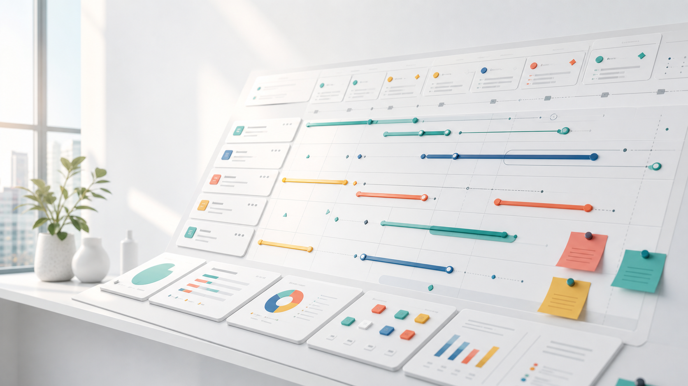

<div class="landing-page">
  <section class="hero" aria-labelledby="landing-title">
    
    <div class="hero__content">
      <p class="eyebrow">Project work, clearly organized</p>
      <h1><span id="landing-title">Team Spaces</span></h1>
      <p class="hero__lede">Keep assignments, projects, meetings, documents, and time in one focused workspace.</p>
      <div class="hero__actions" aria-label="Get started">
        <a class="button button--primary" href="/app#public-demo-entry" data-public-demo-link aria-describedby="public-demo-disclosure">Start with the overview</a>
        <a class="button button--ghost" href="/app" data-workspace-sign-in>Sign in</a>
      </div>
      <p class="hero__note" id="public-demo-disclosure">No account needed. The shared demo is safe to explore and returns to its sample data every day.</p>
    </div>
  </section>
  <section class="landing-demo" aria-labelledby="landing-demo-title" data-public-demo-tour>
    <div class="landing-demo__intro">
      <p class="eyebrow">Explore the workspace</p>
      <h2><span id="landing-demo-title">Follow the work from focus to follow-up</span></h2>
      <p>Take this three-step tour through a populated, editable workspace. It starts with what needs attention, moves into planning, and finishes with a meeting that turns decisions into assigned work.</p>
      <div class="landing-demo__people" aria-label="A demo visitor and four fictional teammates">
        <span title="Demo Visitor">DV</span>
        <span title="Mina Rao">MR</span>
        <span title="Jordan Lee">JL</span>
        <span title="Avery Chen">AC</span>
        <span title="Sam Okafor">SO</span>
        <strong>5 people · shared assignments</strong>
      </div>
    </div>
    <nav class="landing-tour" aria-label="Explore the public demo">
      <a class="landing-tour__card" href="/app#public-demo-entry" data-public-demo-destination="overview">
        <span class="landing-tour__step">01 · Overview</span>
        <h3>See what needs attention</h3>
        <p>Review assigned work, approaching dates, and the health of three active projects.</p>
        <span class="landing-tour__action">Open Overview <span aria-hidden="true">→</span></span>
      </a>
      <a class="landing-tour__card" href="/app/planning#public-demo-entry" data-public-demo-destination="planning">
        <span class="landing-tour__step">02 · Planning</span>
        <h3>Shape and assign the work</h3>
        <p>Move populated task cards, update an assignment, and tailor the workflow columns.</p>
        <span class="landing-tour__action">Open Planning <span aria-hidden="true">→</span></span>
      </a>
      <a class="landing-tour__card" href="/app/meetings#public-demo-entry" data-public-demo-destination="meetings">
        <span class="landing-tour__step">03 · Meetings</span>
        <h3>Turn discussion into follow-up</h3>
        <p>Open a seeded agenda, review its decision record, and follow the work it created.</p>
        <span class="landing-tour__action">Open Meetings <span aria-hidden="true">→</span></span>
      </a>
    </nav>
    <nav class="landing-demo__more" aria-label="More public demo areas">
      <p><small><strong>More to explore:</strong>
        <a href="/app/projects#public-demo-entry" data-public-demo-destination="projects">Projects</a> ·
        <a href="/app/documents#public-demo-entry" data-public-demo-destination="documents">Documents <span>(sample previews; file transfers disabled)</span></a> ·
        <a href="/app/reports#public-demo-entry" data-public-demo-destination="reports">Reports</a> ·
        <a href="/app/admin#public-demo-entry" data-public-demo-destination="team-workflows">Team &amp; workflows</a>
      </small></p>
    </nav>
    <div class="landing-demo__guardrail" role="note">
      <strong>Designed for safe exploration</strong>
      <span>Changes are shared and reset daily <span data-demo-reset-time>at 05:00 UTC</span>. Editing may pause if the shared limit is reached. Do not enter sensitive or personal information.</span>
    </div>
    <p class="landing-demo__legal"><small><a href="LICENSE.txt" download>Apache 2.0 license</a> · <a href="THIRD_PARTY_NOTICES.txt" download>Third-party software notices</a></small></p>
  </section>
</div>

```js
import {beginSignIn, currentSession, enterPublicDemo, runtimeConfig} from "./lib/auth.js";
```

```js
const landingConfig = await runtimeConfig();
const publicDemoLink = document.querySelector("[data-public-demo-link]");
const publicDemoTour = document.querySelector("[data-public-demo-tour]");
const publicDemoDisclosure = document.querySelector("#public-demo-disclosure");
const workspaceSignIn = document.querySelector("[data-workspace-sign-in]");
const demoResetTime = document.querySelector("[data-demo-reset-time]");
const landingSession = await currentSession().catch(() => ({authenticated: false, mode: "cognito"}));

if (landingConfig.authMode === "demo") {
  publicDemoLink.textContent = "Open local demo";
} else if (!landingConfig.publicDemo?.enabled) {
  publicDemoLink.remove();
  publicDemoTour.remove();
  publicDemoDisclosure.remove();
  workspaceSignIn.classList.remove("button--ghost");
  workspaceSignIn.classList.add("button--primary");
} else {
  publicDemoLink.addEventListener("click", async (event) => {
    event.preventDefault();
    publicDemoLink.setAttribute("aria-busy", "true");
    publicDemoLink.textContent = "Opening demo...";
    try {
      await enterPublicDemo();
    } catch (error) {
      publicDemoLink.removeAttribute("aria-busy");
      publicDemoLink.textContent = "Start with the overview";
      publicDemoLink.setAttribute("aria-label", error.message ?? "Unable to open the public demo");
    }
  });
}

if (landingConfig.publicDemo?.resetsAt) demoResetTime.textContent = `at ${landingConfig.publicDemo.resetsAt}`;

if (landingSession.authenticated && landingSession.mode === "cognito") {
  workspaceSignIn.textContent = "Open your workspace";
} else if (landingConfig.authMode === "demo") {
  workspaceSignIn.remove();
} else {
  workspaceSignIn.addEventListener("click", async (event) => {
    event.preventDefault();
    workspaceSignIn.setAttribute("aria-busy", "true");
    workspaceSignIn.textContent = "Opening sign in...";
    try {
      await beginSignIn();
    } catch (error) {
      workspaceSignIn.removeAttribute("aria-busy");
      workspaceSignIn.textContent = "Sign in";
      workspaceSignIn.setAttribute("aria-label", error.message ?? "Unable to start sign in");
    }
  });
}
```
